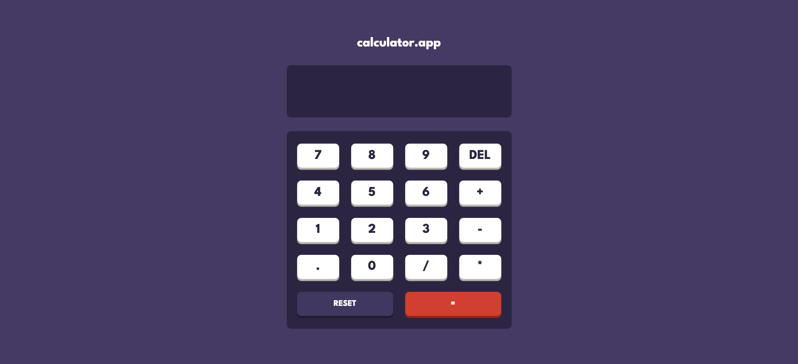

# calculator.app

## Table of contents

- [Overview](#overview)
  - [Screenshot](#screenshot)
  - [Links](#links)
- [My process](#my-process)
  - [Built with](#built-with)
  - [What I learned](#what-i-learned)
  - [Continued development](#continued-development)
  - [Useful resources](#useful-resources)
- [Author](#author)
- [Acknowledgments](#acknowledgments)

**Note: Delete this note and update the table of contents based on what sections you keep.**

## Overview

### Screenshot

### Links

- Solution URL: [https://github.com/imRanDan/calculator-app-main](https://github.com/imRanDan/calculator-app-main)
- Live Site URL: [Add live site URL here](https://your-live-site-url.com)

### My process
I built the layout first and customized the colours to ones I wanted to use. I used grid for the buttons to 
put them in order. 

### Built with

- Semantic HTML5 markup
- CSS
- CSS Grid
- JavaScript

**Note: These are just examples. Delete this note and replace the list above with your own choices**

### What I learned

I learned how to write clean and efficient JavsScript code when it comes to the calculator functions. I liked how I used switch and case to assign the +, -, *, and / functions for the calculator to work.

### Continued development

I would have liked to add media queries to this.

### Useful resources

- [Statements & Switch](https://developer.mozilla.org/en-US/docs/Web/JavaScript/Reference/Statements/switch) - This helped me figure out how to use case and switch with the basic algorithmic function in the calcualator. 
- [Calculator JS Tutorial](https://www.youtube.com/watch?v=j59qQ7YWLxw&t=509s) - This is an amazing tutorial video that helped me figure out some of the functionalities for the calculator to work and display some of the numbers correctly.

## Author

- Website - [Danyal Imran](https://danyalimran.com/)
- Twitter - [@TheRanDan](https://twitter.com/TheRanDan)

## Acknowledgments

Shoutout to Web Dev Simplified for helping me figure out a more efficient way to script the calculator

Another shoutout to frontendmentor for giving the original design out design out
